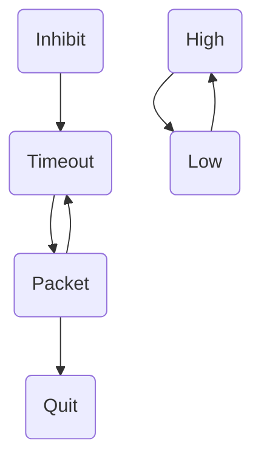

# Virtual watchdog for the [OreSat C3](https://github.com/oresat/oresat-c3-hardware)

The C3 has a radiation tolerant watchdog circuit that will power cycle the whole satellite if it
hasn't been pet in the last 24 seconds (36s on startup). A "pet" is the rising edge of the GPIO
line `PET_WDT`. It should be kept high for a reasonable amount of time, at least ~10ms, but both
the level and falling edge do not reset the timeout. `PET_WDT` is also attached to an LED so having
a pattern that is pleasing to look at is a plus.

This application provides software configurable interface to the watchdog hardware. Currently the
two knobs are the initial inhibit time and ongoing reset time. It also provides a UDP interface
instead of GPIO. This was initially written as a quick-to-start shim that can postpone the watchdog
while more heavyweight processes (like [oresatd](https://github.com/oresat/oresat-c3-software))
start which can take a while, at one point it wasn't able to catch the hardware watchdog in time.



The watchdog listens on UDP localhost:20001 for any packet, which resets the timeout. The contents
do not matter and are discarded. This currently doesn't do any kind of exclusion or voting which
is part of more proper software watchdog system, leaving that for programs up the stack.

## Building
[Install Rust](https://www.rust-lang.org/tools/install) or ensure it is up to date: `rustup update`

Build the program: `cargo b`

### Cross compiling to run on the C3
The C3 is an ARM system so to run the watchdog in its produciton environment you'll need to install
the cross toolchain: `rustup target add armv7-unknown-linux-gnueabihf` and add the `--target` flag
to all cargo commands:

`cargo r --target armv7-unknown-linux-gnueabihf`

To have cargo run the application on the [flatsat C3](https://github.com/oresat/oresat-flatsat) add
 the `card="c3"` cfg option:

`RUSTFLAGS='--cfg card="c3"' cargo r --target armv7-unknown-linux-gnueabihf`

This will execute `.cargo/runner.sh` which is set up to run the watchdog on the flatsat, but you'll
need to be connected to the OreSat VPN for this to work. This script could alternatively be
modified to launch a local VM for local testing.

If running it complains about incompatible GLIBC versions consider using an older cross compiler
toolchain [like this one](https://github.com/abhiTronix/raspberry-pi-cross-compilers), and set the
linker in .cargo/config.toml:

```toml
[target.armv7-unknown-linux-gnueabihf]
linker = ".cargo/cross-pi-gcc-10.3.0-2/bin/arm-linux-gnueabihf-gcc"
```

### Build a debian package:
Install cargo-deb: `cargo install cargo-deb`
Version set in Cargo.toml. If doing a release be sure to also make a tag
`cargo deb --target armv7-unknown-linux-gnueabihf`
Package will be in `target/armv7-unknown-linux-gnueabihf/debian/`
